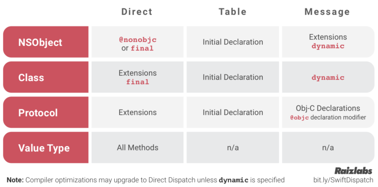
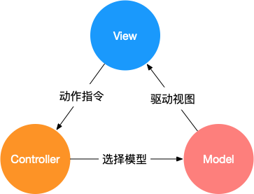
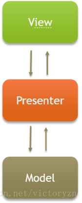
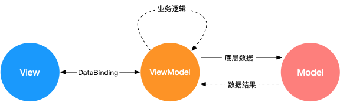

---

---

# iOS相关

- ``RunLoop``：本质就是一个do while循环，当有事做时就做事，没事做时就休眠。
- Run Loop的处理两大类事件源：**Timer Source**和**Input Source**（包括performSelector *方法簇、Port或者自定义的Input Source），每个事件源都会**绑定**在Run Loop的某个特定模式mode上，而且只有RunLoop在这个模式下运行的时候，才会触发Timer和Input Source。
  
- Run Loop 运行时只能以一种固定的模式运行，如果我们需要它切换模式，只有停掉它，再重新开启它。
  
- source 0（手势识别）非基于port的，即用户触发的事件，需要手动唤醒线程，将当前线程由内核态切换到用户态；source 1（事件响应：硬件事件，触摸/锁屏/摇晃）基于port的，监听系统端口与通过内核和其他线程发送的消息，能主动唤醒runloop，接收分发系统事件。


- ​	RunLoop和线程的关系：

  1. runloop与线程是==一一对应==的，一个runloop对应一个核心的线程，为什么说是核心的，是因为runloop是可以嵌套的，但是核心的只能有一个，他们的关系保存在一个全局的字典里。
  2. runloop是来管理线程的，当线程的runloop被开启后，线程会在执行完任务后进入休眠状态，有了任务就会被唤醒去执行任务。
  3. runloop在第一次获取时被创建，在线程结束时被销毁。
  4. 对于主线程来说，runloop在程序一启动就默认创建好了。
  5. 对于子线程来说，runloop是**==懒加载==**的，只有当我们使用的时候才会创建，所以在子线程用定时器要注意：确保子线程的runloop被创建，不然定时器不会回调。


# Swift语言相关

## 基础知识

- Set、Dictionary、Array遵守Collections协议。

- 隐式解包`!`，当一个可选值在被赋值后，总是有值，那么就可以使用隐式解包，在`class`的初始化时常用。

- **copy on write**：

  - 线程安全：如果多个线程要修改原容器，会加锁，所以是线程安全的。
  - 实现方式：在结构体内部存储了一个指向实际数据的引用reference，在不进行修改操作的**普通传递**过程中，都是将内部的reference的应用计数+1，在进行修改时，对内部的reference做一次copy操作，再在这个复制出来的数据进行真正的修改，防止和之前的reference产生意外的数据共享。
  - 如果值类型里嵌套了引用类型，那么修改引用类型的值时，外层的值类型并不会拷贝，因为引用类型的地址并没有变化，相当于并没有修改值类型。

- 类的恒等运算符```===```和不恒等运算符``!==``。

- 懒加载（延迟存储属性）：``lazy var``，当第一次被调用的时候才会计算其**初始值**的属性。

- ``is``：表示某个实例是否是某个类。

- `@escaping`逃逸闭包：该闭包会在函数return后执行。

- `@autoclosure`自动闭包：将参数自动封装为闭包参数。

- `struct`,`enum`,`tuple`为值类型，存储于栈区。`class`, `closure`,`function`为引用类型，存储于堆区。

- 可失败的构造器``init?``构造失败返回``nil``。

- 析构器``deinit()``：只用于``class``，当该实例被赋值为``nil``且**引用计数为0**时调用。

- `class`的初始化`init`：

  - **全能初始化**和**便利初始化**

    - **全能初始化**：能初始化所有的非Optional的store property

    - **便利初始化**`convenience init`：只初始化部分属性

    - 全能初始化方法和便利初始化方法之间的调用规则：

      1. 全能初始化方法必须调用父类的全能初始化方法
      2. 便利初始化方法只能调用当前类的初始化方法，*不能调用父类的初始化方法*
      3. 便利初始化方法，*最终**必须调用**当前类的全能初始化方法*

      

  - **类的两段初始化**

    - 安全性检查（编译阶段）

      1. 全能初始化方法必须确保在==父类被初始化**之前**==，所有自己的属性被正确初始化。
      2. 再给被继承的属性赋值之前，必须调用父类的全能初始化方法，也就是说，父类必须被初始化之后才能给被继承的属性赋值。
      3. 便利初始化方法在对属性赋值之前，必须调用其它初始化方法。（所以很多时候`convenience init()`的第一行就为`self.init()`）
      4. 在当前类没有被正确初始化之前（即第一阶段），==**不能调用**==类的实例方法和读取实例属性。

    - 两个阶段（从下至上，又从上至下）

      - **第一阶段**：

        1. 调用全能初始化方法或者便利初始化方法，系统分配内存，但是并未对这个类进行初始化
        2. 在全能初始化方法中初始化所有属性
        3. 调用父类的全能初始化方法执行前两个相同的步骤
        4. 沿着继承链不断向上一直到根类为止
        5. 这个时候在继承链上的类都被正确的初始化，第一阶段完成

      - **第二阶段**：

        1. 从根类开始向下返回，每个类的全能初始化方法都能够进行更多的对类的初始化操作，包括可以使用属性，可以调用实例方法

        2. 最后，任何**便利方法**都有机会去对类进行更多的初始化

- 捕获值：用于**嵌套函数**和**闭包**，外部的变量相对于嵌套函数是一个全局变量。

  - 隐式捕获和显式捕获

    ```swift
    struct simpleClass {
        var val = 0
    }
    
    var x = simpleClass()
    var y = simpleClass()
    
    let closure = { [x] /* 捕获列表 */ in  
        我们显式捕获了x，则在该闭包里的x就是let x = x。因为是struct值类型，所以下文输出"x=0"，如果是class的话那么x就是地址，输出则会变化。
        隐式捕获了y，所以在调用y的时候才捕获，所以下文输出"y=10"。
        print("x=\(x.val), y=\(y.val)") // 输出"x=0, y=10"
    }
    
    x.val = 10
    y.val = 10
    
    closure()
    ```

- **ARC(automatic reference counting)内存管理机制**

  - 引用计数只适用于`class`的实例，不适用于`struct`和`enum`（因为是值类型）。
  - ``strong``, ``weak``, `` unowned``：
    - strong 代表着强引用，是默认属性。当一个对象被声明为 strong 时，就表示父层级对该对象有一个强引用的指向。此时该对象的引用计数会增加1。
    - weak 代表着弱引用。当对象被声明为 weak 时，父层级对此对象没有指向，该对象的引用计数不会增加1。它在对象释放后弱引用也随即消失。继续访问该对象，==**程序会得到 nil，不会崩溃**==。用`weak`修饰的变量必然是**可选类型**，因为可以置`nil`。在闭包中修饰的变量也自动变为可选类型。
    - unowned 与弱引用本质上一样。唯一不同的是，对象在释放后，依然有一个无效的引用指向对象，它不是 Optional 也不指向 nil。如果继续访问该对象，==**程序就会崩溃**==。用`unowned`修饰的变量不会变成可选类型。
    - weak和unowned的使用场景：当另一个实例的生命周期较短时，即当另一个实例可以**首先被释放**时，使用`weak`引用。相反，当另一个实例有相同的生命周期或更长的生命周期时，使用`unowned`引用。
  
- ``enum``的``associated value``

  ```swift
  enum Barcode {
      case upc(Int, Int, Int, Int)
      case qrCode(String)
  }
  
  关联值如果当作常数取出，那么用let，如果当作变量取出，那么用var
  switch productBarcode {
  case .upc(let numberSystem, let manufacturer, let product, let check):
      print("UPC: \(numberSystem), \(manufacturer), \(product), \(check).")
  case .qrCode(var productCode):
    	productCode.append("suffix")
      print("QR code: \(productCode).")
  }
  ```

- ``guard``：

  ```swift
  声明： 
        1> guard 必须使用在函数里面
        2> guard 语句必须带有else语句   
  语法如下：
         · 当条件表达式为 true 时跳过 else 语句内容，执行语句组内容
         · 条件表达式为 false 时执行 else 内容，跳过语句不能fallthrough，所以一般为return、break、continue、throw。
  例子：
  func example() {
      guard 1 < 2 else {
          print("不会输出")
          return
      }
      guard 1 > 2 else {
          print("一定输出")
          return
      }
  }
  ```

- ``defer``：就是 `defer` block 里的代码会在函数 return 之前执行，无论函数是从哪个分支 return 的，还是有 throw，还是自然而然走到最后一行。

  ```swift
  例子：
  func example() {
      defer {
          print("最后输出")
      }
      print("先输出")
  }
  ```

  > 函数必须先执行到 defer 才会触发

  

- 访问控制：

| 关键字         | 说明                                                         |
| -------------- | ------------------------------------------------------------ |
| open           | public修饰的==class==允许外部模块调用，但是不允许继承，而open修饰的class即允许其他模块调用，也**允许被子类继承**。public修饰的==成员变量==允许其他模块调用，但不能被覆盖(override)，而open修饰的成员既允许被其他模块调用，也**可以被子类覆盖**。 |
| public         | 可以访问自己模块中源文件里的任何实体，别人也可以通过引入该模块来访问源文件里的所有实体。 |
| internal(默认) | 在模块内部可以访问到，超出模块内部就不可被访问了。           |
| fileprivate    | 文件内私有，只能在当前源文件中使用。                         |
| private        | 只能在类中访问，离开了这个类或者结构体的作用域外面就无法访问。 |

- **派发机制**：swift派发的目的是让CPU知道被调用的函数在哪里。swift语言支持编译行语言的==直接派发==、==函数表派发==、==消息机制派发==。

  >Java 默认使用函数表派发， 但你可以通过 `final` 修饰符修改成直接派发。
  >
  >C++ 默认使用直接派发，但可以通过加上 `virtual` 修饰符来改成函数表派发。
  >
  >Objective-C 则总是使用消息机制派发， 但允许开发者使用 C 直接派发来获取性能的提高。

  - **直接派发（静态调用）**：最快的，编译器可优化，例如函数内联等。但是缺乏动态性，无法继承。
  - **函数表派发**：函数表派发具有动态性，在swift里函数表叫**Witness Table**，类会有一个数组来存储里面的函数指针。
  - **消息机制派发**：当一个消息被派发，程序运行时就会按**照继承关系从下向上**查找被调用的函数。但是效率不高，所以通过缓存来提高效率，缓存后性能和函数表派发差不多。KVO和CoreData都是这种机制的运用。



- Swift 既是面向对象的，又是函数式的编程语言。

  说 Swift 是面向对象的语言，是因为 Swift 支持类的封装、继承、和多态，从这点上来看与 Java 这类纯面向对象的语言几乎毫无差别。

  说 Swift 是函数式编程语言，是因为 Swift 支持 map, reduce, filter, flatmap 这类去除中间状态、数学函数式的方法，更加强调运算结果而不是中间过程。

> 函数编程的主要思想是把运算过程尽量写成一系列嵌套的函数调用

- 为什么将String，Array，Dictionary设计成值类型？

  - 值类型相比引用类型，最大的优势在于==内存使用的高效==。值类型在**栈**上操作，引用类型在**堆**上操作。栈上的操作仅仅是单个指针的上下移动，而堆上的操作则牵涉到合并、移位、重新链接等。也就是说Swift这样设计，大幅减少了堆上的内存分配和回收的次数。同时copy-on-write又将值传递和复制的开销降到了最低。
  - String，Array，Dictionary设计成值类型，也是为了==线程安全==考虑。通过Swift的let设置，使得这些数据达到了真正意义上的“不变”，它也从根本上解决了多线程中内存访问和操作顺序的问题。
  - 设计成值类型还可以提升==API的灵活度==。例如通过实现Collection这样的协议，我们可以遍历String，使得整个开发更加灵活高效。（面向协议的优势）
- KVC和KVO

  - KVC：key-value-coding。Swift中的KeyPath。KeyPath<Root, Type>，使用：object[keyPath: ···]
  - KVO：Key-Value-Observing。

## Swift介绍

- 介绍下Swift

Swift是苹果于2014年WWDC（苹果开发者大会）发布的新开发语言，可与Objective-C共同运行于MAC OS和iOS平台，用于搭建基于苹果平台的应用程序。

Swift是一门类型安全的语言。

- 相比OC有什么优缺点

|                    | Swift                               | Objective-C          |
| ------------------ | ----------------------------------- | -------------------- |
| 语言特性           | 静态语言，更加安全                  | 动态语言，不那么安全 |
| 语法               | 精简                                | 冗长                 |
| 命名空间           | 有                                  | 无                   |
| 派发机制           | 直接调用，函数表调用，消息转发      | 消息转发             |
| 泛型/元组/高阶函数 | 有                                  | 无                   |
| 语言效率           | 更高更快                            | 略低                 |
| 文件特性           | .swift单文件                        | .h/.m                |
| 编程特性           | 可以更好地实现函数式编程/响应式编程 | 面向对象编程         |

> 高阶函数：接受至少一个函数作为参数；返回的结果是一个函数。
>
> 命名空间：是对作用域的一种特殊的抽象。
>
> Swift没有运行时特性。

## 面向协议编程

面向协议是用协议的方式组织各个类的关系，Swift底层几乎所有类都构建在协议之上。

面向协议能够解决面向对象的菱形继承，横切关注点和动态派发的安全性等问题。

针对某个要实现的功能，我们可以使用协议定义出**接口**，然后利用协议扩展提供默认的实现。

## 添加存储属性

使用``extension``添加**存储属性**，使用OC的关联属性：

```swift
public extension UIView {
    private struct AssociatedKey {
        static var identifier: String = "identifier"
    }
    
    public var identifier: String {
        get {
            return objc_getAssociatedObject(self, &AssociatedKey.identifier) as? String ?? ""
        }
        
        set {
            objc_setAssociatedObject(self, &AssociatedKey.identifier, newValue, .OBJC_ASSOCIATION_COPY_NONATOMIC)
        }
    }
}
```

# SwiftUI

- 介绍：SwiftUI 是苹果公司于 2019 年推出的 Apple Platform 的新一代声明式布局引擎。

- **布局**：

  - 过程：

    1. 父view为子view提供一个建议的size

    2. 子view根据自身的特性，返回一个size

    3. 父view根据子view返回的size为其进行布局

  - `.frame`起的作用就是提供一个建议的size

    

    frame的ideal必须和fixedSize()一起使用才行。

  - GeometryReader的功能之一：

    1. 获取到父view的建议尺寸。 ``geo.size``
    2. 获得它能够让我们获取到某个view相对某个坐标空间的bounds。``geo.frame(in: .global/.name("..."))`` 声明space：``.coordinateSpace(name: "spaceName")``

  - ``.alignmentGuide(.leading) { d in d[.leading] }``：默认情况下相当于这种。其中d为一个``ViewDimensions``，包含了这个view的size和其对齐方式。

  - ``PreferenceKey``向父View传递信息

    ```swift
    public protocol PreferenceKey {
      associatedtype Value
      static var defaultValue: Self.Value { get }
      static func reduce(value: inout Self.Value, nextValue: () -> Self.Value)
    }
    子View：.preference(key: NumericPreferenceKey.self, value: 1)
    父View：.onPreferenceChange(NumberPreferenceKey.self) { value in
              // do something...
            }
    ```

- 动画：``AnimatableData: VectorArithmetic``，``AnimatablePair``。

- **多线程** ``DispatchQueue``：

```swift
queue对象：
DispatchQueue.main // UI相关
DispatchQueue.global(qos: QoS) // 非UI，其他用户服务相关
Qos: 	// quality of service
.userInteractive 	// do this fast, the UI depends on it!
.userInitiated  	// the user just asked to do this, so do it now
.utility					// this needs to happen, but the user didn’t just ask for it
.background				// maintenance tasks (cleanups, etc.)

queue执行函数：
queue.async { /* code to execute on queue */ }
queue.sync { /* code to execute on queue */ }

```

- UserDefault：

```swift
emojiArt = EmojiArt(json: UserDefaults.standard.data(forKey: "EmojiArtDocument.\(self.id.uuidString)")) ?? EmojiArt()

autoSaveCancellable = $emojiArt.sink { (emojiArt) in
      UserDefaults.standard.setValue(emojiArt.json, forKey: self.defaultKey)
}
```

- Property Wrapper：@State, @ObservedObject, @Binding, @EnvironmentObject的映射值都是一个Binding。@Published则是一个Publisher。@Environment则是none。
- Publisher：

```swift
Publisher<Output, Failure> // Failure can be Never

cancellable = myPublisher.sink(
			receiveCompletion:{ result in ... }, //result is a Completion<Failure> enum
      receiveValue: { thingThePublisherPublishes in ... }
  )
```

- CoreData

> 是一个**面向对象**的数据库。
>
> 在map中创建的对象都是ObservableObject。

```swift
初始化时：
会设置.environment(\.managedObjectContext)为一个NSManagedObjectContext。相当于该数据库。

存取数据：
@Environnment(\.managedObjectContext) var context
存：
let flight = Flight(context: context)
flight.aircraft = "B737" // etc.
let ksjc = Airport(context: context)
ksjc.icao = "KSJC" // etc.
flight.origin = ksjc // this would add flight to ksjc.flightsFrom too 
try? context.save()
取：
// 设置request
let request = NSFetchRequest<Flight>(entityName: "Flight") 
request.predicate = NSPredicate(format: "arrival < %@ and origin = %@", Date(), ksjc) 
request.sortDescriptors = [NSSortDescriptor(key: "ident", ascending: true)] 
删：
context.deleteObject(flight)

let flights = try? context.fetch(request) // past KSJC flights sorted by ident
// flights is nil if fetch failed, [] if no such flights, otherwise [Flight]

和SwiftUI集成：
@FetchRequest(entity:sortDescriptors:predicate:) var flights: FetchedResults<Flight>
@FetchRequest(fetchRequest:) var airports: FetchedResults<Airport>
```

- FileManager

```swift
首先找到一个根目录：
let url = FileManager.default.urls(for: .documentDirectory, in: .userDomainMask).first!

某个目录下的所有子目录：
let documents = try FileManager.default.contentsOfDirectory(atPath: directory.path)

使用Data(contendsOf: url)读取数据：
self.emojiArt = EmojiArt(json: try? Data(contentsOf: url))

使用write(to: url)存入数据：
emojiArt.json.write(to: url)
```

```swift
URL的方法：
func appendingPathComponent(String) -> URL
func appendingPathExtension(String) -> URL // e.g. jpg 
```

- 和UIkit集成

```swift
UIViewRepresentable/UIViewControllerRepresentable

五个部分：
1. a function which creates the UIKit thing in question (view or controller)
func makeUIView{Controller}(context: Context) -> view/controller
2. a function which updates the UIKit thing when appropriate (bindings change, etc.) 
func updateUIView{Controller}(view/controller, context: Context)
3. a Coordinator object which handles any delegate activity that goes on
func makeCoordinator() -> Coordinator // Coordinator is a don’t care for Representables
4. a Context (contains the Coordinator, your SwiftUI’s environment, animation transaction) // passed into the methods above
class Coordinator: NSObject, someDelegate {}
5. a “tear down” phase if you need to clean up when the view or controller disappears 
func dismantleUIView{Controller}(view/controller, coordinator: Coordinator)
```

# 其他

## 1.MVC/MVP/MVVM（框架模式）

### MVC

Model：模型层。通常模型对象负责在**数据库**中存取数据。

View：视图层，通常视图是**依据模型**数据创建的。

Controller：控制器，数据模型和视图之间通信的桥梁，通常控制器负责从视图读取数据，控制用户输入，并向模型发送数据。

​	过程：

- ​	View 传送指令到 Controller ；
- ​	Controller 完成业务逻辑后，要求 Model 改变状态 ；
- ​	Model 将新的数据发送到 View，用户得到反馈。



### MVP

 在**MVP**中，View并不直接使用Model，它们之间的通信是通过**Presenter** (MVC中的Controller)来进行的，所有的交互都发生在Presenter内部。



### MVVM

MVVM（相比MVP有**数据绑定**，数据更新UI自动更新）

Model：模型，指的是后端传递的数据。

View：视图，指的是所看到的页面。（无状态的、申明式的、响应式的）

ViewModel：视图模型，mvvm模式的核心，它是连接view和model的桥梁。主要用来处理业务逻辑。（intends, access to model）



## 2.RN/Flutter/Weex

### Reactive Native

React Native (简称RN)是Facebook于2015年4月开源的跨平台移动应用开发框架，是Facebook早先开源的JS框架 React 在原生移动应用平台的衍生产物，支持iOS和安卓两大平台。RN使用Javascript语言，类似于HTML的JSX，以及CSS来开发移动应用，因此熟悉Web前端开发的技术人员只需很少的学习就可以进入移动应用开发领域。

主张**Learn once, write everywhere**，可以使用原生的iOS组件。

### Flutter

Flutter是谷歌的移动UI框架，可以快速在iOS和Android上构建高质量的原生用户界面。

使用Dart，可以在多平台上使用。

### Weex

Weex 致力于使开发者能基于通用跨平台的 Web 开发语言和开发经验，来构建 Android、iOS 和 Web 应用。简单来说，在集成了 WeexSDK 之后，你可以使用 JavaScript 语言和前端开发经验来开发移动应用。

Weex 应用需要**依赖前端框架**来编写，但 Weex 并没有绑定、限制在特定的框架上。目前 Vue.js 和 Rax 是最广泛应用于 Weex 开发的前端框架，也是目前功能最全、最稳定的方案。

